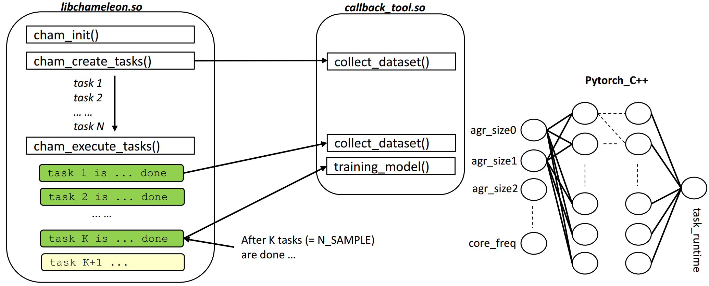

## Chameleon Tool
This is a tool for predicting task-runtime with an online trained model. The model is currently based on the argument sizes of each task and the CPU core frequency. The working flow is shown as follow:
<p align="center">
  
</p>

## Package organization
The code is organized as follow:
* build/: 
* figures/:
* python_utils/:
* src/:

## How it works
As the principle of Chameleon lib, there is an additional thread for monitoring and scheduling all tasks with the strategy of work-offloading. This callback tool is loaded by the Cham-communication thread. So, three stages would be intefered by this callback tool:
*   creating_tasks(): the callback of creating tasks would collect data
*   execute_tasks(): after K tasks are done, this means that the prediction module would be called for training.
*   After the model is trained, the remaining tasks from the (K+1) task could be predicted the runtime based on the trained model.


## Prerequisites
*   Adapt the path of this callback-tool shared-lib file (libtool.so). The tool would be loaded in the src `~/chameleon/src/chameleon_tools.cpp`,
```C
  char * cham_tool_path = getenv("CHAM_TOOL_DIR");
  if (cham_tool_path != NULL){
        DBP("Found CHAM_TOOL at %s\n", cham_tool_path);
  } else {
        fprintf(stderr, "Error: couldn't find the tool!\n");
        exit(EXIT_FAILURE);
  }  
  void *handle = dlopen(cham_tool_path, RTLD_LAZY|RTLD_LOCAL);
```
*   So, we could use an env-variable to adapt at the compiling step. Set CHAM_TOOL_DIR=`".../libtool.so"`
*  To compile the tool, we use CMake (CMakeLists.txt in more detail). Please rememeber to export ENV for Chameleon lib and Pytorch-C++ lib-folder.
    *   For Pytorch-C++, download here: https://pytorch.org/get-started/locally/. The version could be for Linux/LibTorch/C++, and with or without CUDA.
    *   Specify the path to CMake for compiling the tool (e.g., like the script in `./build/cmake-script.sh`).

## Compiling & Integrating with Chameleon
If everything is fine as Prerequisites and `cmake-script.sh`, we could compile the tool by running the script.
``` Bash
# if the current location at ./build
source cmake-script.sh
# or
./cmake-script.sh
```

## Test the tool & Chameleon
There are examples in ../examples/ that we could test the tool. Included some config-scripts for compiling and submitting jobs on SuperMUC-NG.

## Test with Samoa
TODO

## Evaluate the overhead and accuracy
TODO