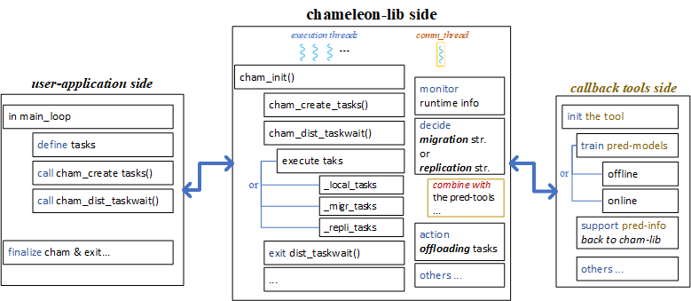
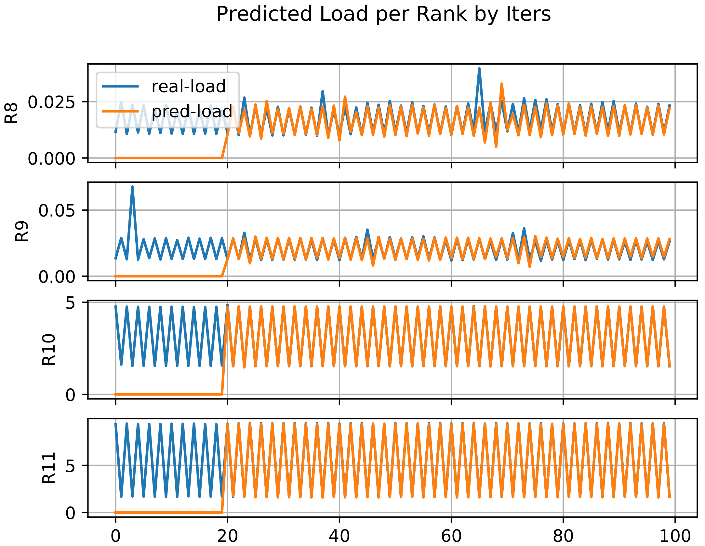

## Chameleon Load Prediction Tool & Proactive Task Offloading Strategy
The document shows how the online prediction scheme and proactive task offloading work. We design the module as a callback tool outside Chameleon depending on domain-specific applications. The examples are illustrated through a synthetic test case (MxM) and an iterative simulation named Sam(oa)2 (adaptive mesh refinement with solving partial differential equations - PDEs).

## Working Flow
<p align="left">
  
</p>

Figure (A) shows the reactive load balancing approach, where the dedicated thread (`Tcomm`) is used to continuously monitor the execution speed/rank and react migrating tasks when the imbalance happens. In contrast, Figure (B) reveals the proactive approach. `Tcomm` characterizes task and runtime in several first iterations (`char`, `data_collect`), then train the prediction model (`trainM`) and load it afterwards (`loadM`). When the model is loaded, the prediction results of load per rank will input to the proactive algorithm (`proact_mig`), which can guide task migration/offloading.

## An Example with Proactive Task Offloading Algorithm
<p align="left">
  
</p>

After the prediction phase, its result is transferred to the algorithm. The first step is sorting the involved ranks by the exchanged values of load prediction (where `load` accounts for the wall clock execution time of a specific iteration, e.g.,  means the wall clock execution time of Rank 1 in Iteration 10). We need an array to record the total load of tasks executed at the local rank (`local tasks`), and another one for tasks executed at the remote rank (`remote tasks`). Furthermore, a table is used to track the number of local and remote tasks.

In general, the algorithm consists of two $for$-loops. The first loop will go through the victims () which have . In the second loop, each offloader (), who has , will be traversed.  is the load difference between an offloader and , while  is the one between a victim and . After that, we can compute the number of tasks that should be offloaded to fill the gap of  at the victim side. If the current offloader does not have enough tasks to fill  up, the next one will be processed.

The figure above shows an imbalance case of 8 ranks with uniform tasks. The number of tasks per rank causes the given imbalance. We assume that the prediction information is ready here; the inputs of the proactive algorithm are total load () and the number of tasks in the queue per rank. As we can see in the first step (`Init step`), `LoadArr(local)` holds the total load, `TrackingTable(8,8)` indicates 8 ranks involved, and the diagonal line points to the number of local tasks associated with a corresponding rank. After sorting the predicted load (descending), the order of ranks is `R0, R1, R6, R7, R2, R3, R4, R5`.
The first loop goes to the victim - `R5`, and the first offloader is `R0`. Next, we estimate that `R0` should offload 113 tasks to `R5` based on the values of , , . The new load values of `local` & `remote` are updated; the tracking table also needs to update the number of migrated tasks at the current offloader row (0 for `R0`). Finally, the output shows that `R0` should migrate 64, 96, ... tasks to the corresponding victims (`R1`, `R2`, ...).

## Dependencies
At the current status, there're 2 options for using built-in machine-learning API:
* Pytorch C++ (https://pytorch.org/cppdocs/installing.html)
  * Do not need to install, but we have to link it when compiling the tool (as the sample compile script in the directory `build/`).
  * Note: might have some overhead and issues with Torch C++.
* Mlpack C++ (https://www.mlpack.org/getstarted.html)
  * Need to install with the dependencies (Armadillo, Boost, ensmallen)
  * We can follow here https://www.mlpack.org/doc/mlpack-3.4.2/doxygen/build.html

## Package organization
The module is organized as follow:
* `build/`: a sample script to link and build the tool with Chameleon (`TODO`: need to adapt dependencies at your side).
* `chameleon_patch/`: the src-code of the Chameleon lib (latest version) with some changes to fit the prediction tool. For compiling, we just need to replace these files in this patch with the original Chameleon.
* `mlpack_utils/`: some examples with mlpack library to build the regression models.
* `python_utils/`: some examples with scikit-learn/mlpack lib in Python, to build and test the regression models.
* `src/`: the src-code of the tool.

## Different Configurations with Prediction Tool and Proactive Task Offloading
The tool works as the plugin of Chameleon lib (like the event-based working flow). There are callback events defined to override the Chameleon internals.

<p align="left">
  
</p>

For example, the figure above shows the main internals that we can interfere with, e.g., `cham_create_tasks()` for getting task's arguments information. Furthermore, we can completely insert external actions like loading the prediction results before a new execution phase of tasks is processed by calling `cham_dist_taskwait()`. Therefore, the dedicated thead can be used to train a prediction model along with the main execution, then adapt the results to our proactive algorithm.

There are several modes for training prediction models and loading to the proactive task offloading algorithm as follows (whic are defined in `/chameleon_patch/chameleon_common.h`).

``` CXX
#ifndef CHAM_PREDICTION_MODE
#define CHAM_PREDICTION_MODE 0      // no prediction
// #define CHAM_PREDICTION_MODE 1   // total load prediction per iteration, and predict the next iterations by the current load of previous ones
// #define CHAM_PREDICTION_MODE 2   // total load prediction per iteration, and use the predicted-values to input the prediction of next iterations
// #define CHAM_PREDICTION_MODE 3   // load prediction per a single task based on its characteristics, e.g., input arguments
#endif

#ifndef CHAM_PROACT_MIGRATION
#define CHAM_PROACT_MIGRATION 0 // just load the prediction results, do not apply to proactively offload tasks
// #define CHAM_PROACT_MIGRATION 1 // load the prediction results iter-by-iter, and adapt them to proactively offload tasks
// #define CHAM_PROACT_MIGRATION 2 // load the prediction results for the whole future, then adapt them to proactively offload tasks
#endif

// If the offload-task-separately flag is 1, tasks are offloaded by the first strategy (round-robin fashion). Otherwise, tasks are packed into a single package and send at once to the victim.
#ifndef OFFLOAD_SEND_TASKS_SEPARATELY
#define OFFLOAD_SEND_TASKS_SEPARATELY 0
#endif

#endif
```

## Compiling The Tool
There are some sample scripts for compiling the tool in the directory `build/`. But notably, we need to adapt the dependencies installed in our own environment that are declared in CMakeLists.txt.

## Compiling Chameleon & Linking with The Tool
To run Chameleon with the exteral tool, we need to indicate where is the shared library (`.so`) of the tool. In general, there're some steps:
* Copy and overwrite the original version of Chameleon source with the code files in `chameleon_patch/`.
* Loading dependencies: libffi, hwloc, and the corresponding compiler (e.g., Intel).
* Set env-flags for the tool:
  * CHAMELEON_TOOL=1
  * CHAMELEON_TOOL_LIBRARIES=/path/to/the-compiled-tool (.so)
* Regarding the Chameleon-lib internal flags (as migration, replication modes), please set:
  * -DENABLE_COMM_THREAD=1 -DENABLE_TASK_MIGRATION=0 -DCHAM_REPLICATION_MODE=0 -DCHAM_PREDICTION_MODE=2 -DCHAM_PROACT_MIGRATION=2 -DOFFLOAD_SEND_TASKS_SEPARATELY=1
  * For different modes of the prediction tool and proactive task offloading, we just need to change the values of these compile variables.

## Test The Tool & Chameleon
Currently, the examples are `MxM` and `Sam(oa)2` with the simulation of oscillating lake.

## Evaluate The Online Prediction Tool
The current usecase is Samoa-ADERDG-OPT (https://gitlab.lrz.de/samoa/samoa/-/tree/ADER-DG-opt) with Oscillating-Lake scenario. The following test was performed on CoolMUC2 (LRZ), 16 nodes, 2 ranks per node, 14 threads per rank. The line charts show the comparison between real and predicted load. Where, the simulation was run with 100 time-steps, i.e., R8 to R11 are shown below, the results of other ranks could find in `/python_utils/figures/`.
<p align="left">
  
</p>
