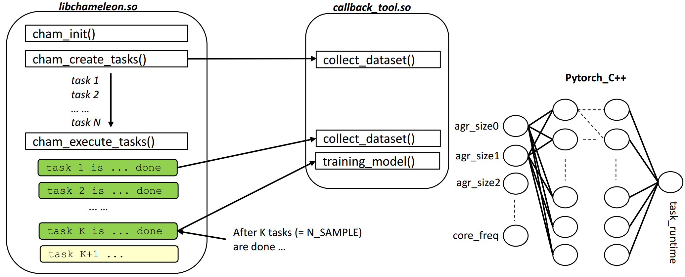
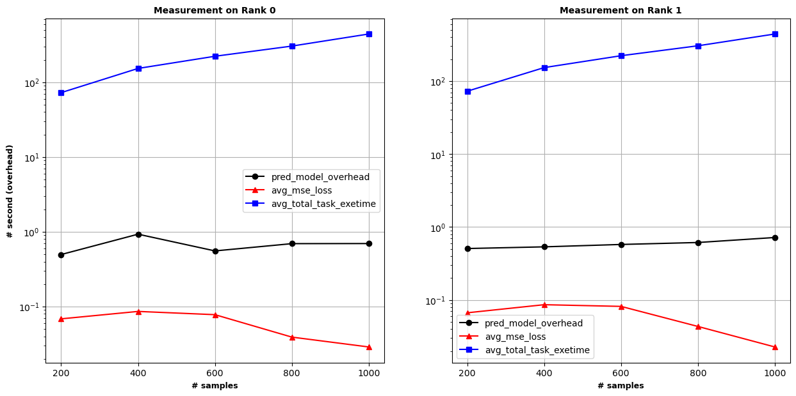

## Chameleon Tool
This is a tool for predicting task-runtime with an online trained model. The model is currently based on the argument sizes of each task and the CPU core frequency. The working flow is shown as follow:
<p align="center">
  
</p>

## How it works
As the principle of Chameleon lib, there is an additional thread for monitoring and scheduling all tasks with the strategy of work-offloading. This callback tool is loaded by the Cham-communication thread. So, three stages would be intefered by this callback tool:
*   creating_tasks(): the callback of creating tasks would collect data
*   execute_tasks(): after K tasks are done, this means that the prediction module would be called for training.
*   After the model is trained, the remaining tasks from the (K+1) task could be predicted the runtime based on the trained model.

## Prerequisites
*   Adapt the path of this callback-tool shared-lib file (libtool.so). It could be fixed in the src `~/chameleon/src/chameleon_tools.cpp`,
```C
void *handle = dlopen("~/.../libtool.so", RTLD_LAZY|RTLD_LOCAL);
```
*   or set the ENVIRONMENT_VARIABLE to adapt.
*  To compile the tool, we use CMake (CMakeLists.txt for more detail). Please rememeber to export ENV for Chameleon lib and Pytorch-C++ lib-folder.
    *   For Pytorch-C++, download here: https://pytorch.org/get-started/locally/. The version could be for Linux/LibTorch/C++, and with or without CUDA.
    *   Specify the path to CMake for compiling the tool (e.g., like the script in `./build/cmake-script.sh`).

## Compiling the tool
If everything is fine as Prerequisites and `cmake-script.sh`, we could compile the tool by running the script.
``` Bash
# if the current location at ./build
source cmake-script.sh
# or
./cmake-script.sh
```

## Test the tool
There is an example in /examples/mxm which we could test the tool. Included some config-scripts for compiling and submitting jobs on SuperMUC-NG

## Evaluate the overhead and accuracy
Just a quick evaluation about the training overhead, compared to the total computation-time of all tasks. In detail, this test is performed on 2 MPI Ranks (24 threas per rank), on 2 seperate nodes (SuperMUC-NG, test-partition). The number of tasks per rank is varied from 200 to 1000 (problem-size of each task is generated randomly - uniform distribution). Following that, the number of samples for training online is 50% of num_tasks (100, 200, 300, ...) with the default NUM_EPOCHs = 1000 (this factor could be varied for checking the prediction-model tool overhead).

<p align="center">
  
</p>